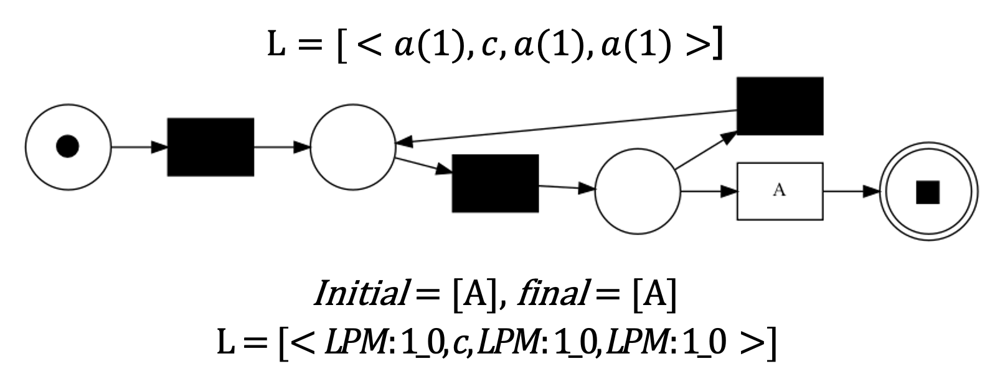

# subdue_compression_with_lpm
Partendo dall'algoritmo di Process Mining Subdue, l'obiettivo del seguente progetto è la realizzazione di un algoritmo di compressione che operi con la stessa logica, accettando in input file di log anziché grafi. <br>
Subdue è un algoritmo di clustering gerarchico e concettuale, ne deriva che ogni cluster è descritto da un’etichetta e diviso in sotto-cluster.<br>
L’obiettivo è di comprimere il grafo, sostituendo tutte le istanze di una sotto-struttura con un puntatore alla struttura stessa. Per determinare il sotto-grafo candidato, il criterio di scelta si basa sulla Minimum Description Length (MDL). <br>
Per accettare in input file di log anziché grafi, si renderebbero necessarie le seguenti modifiche all’algoritmo:
- La struttura in ingresso deve essere un file di log;
- Utilizzare una differente metrica di compressione che tenga conto del concetto di traccia;
- Il processo di sostituzione deve eliminare dal file di log gli eventi della sotto-struttura di interesse, sostituendo la prima occorrenza dell’evento con un’etichetta.

Alla luce delle precedenti problematiche, si è deciso di sviluppare un nuovo algoritmo indipendente da Subdue;

# Team
- <a href= "https://github.com/LucreziAntenucci98">Antenucci Lucrezia</a>;
- <a href= "https://github.com/AlessandroMele">Mele Alessandro</a>;
- <a href= "https://github.com/dadezzzzz">Traini Davide</a>;

# Prerequisiti
- Visual Studio Code;
- Python 3.7.4;
- <a href= "https://pm4py.fit.fraunhofer.de">Pm4Py</a>;

# Installazione delle dipendenze
Per installare Pm4py è necessario eseguire da linea di comando:
```bash
pip install pm4py
```
# Generazione LPM ed algoritmo di etichettatura
<a href="http://www.promtools.org/doku.php">ProM</a> è un framework open-source sviluppato in Java, estensibile e capace di supportare una grande varietà di tecniche di Process Mining sotto forma di plug-in. Nella seguente trattazione, è stato utilizzato per generare i Local Process Model (LPM), i quali sono analoghi ai grafi candidati generati da Subdue.<br>
Un Local Process Model (LPM) è una rete di Petri di piccole dimensioni, general- mente composta da cinque o sei nodi, che identifica un comportamento molto fre- quente in un event log; Tramite ProM, sono stati generati i LPM che fungeranno da input per l’algoritmo di etichettatura degli eventi nel file di log.<br>

# Algoritmo di etichettatura
<a href="">L’algoritmo di etichettatura</a> richiede in input un file di log in formato .XES e gli LPM precedentemente ottenuti. In output, restituisce il file .XES originale in cui ad ogni evento è assegnata una lista che contiene, se presenti, gli indici dei LPM in cui l’evento compare. <br>
L’evento, per poter essere etichettato, deve comparire in una traccia valida, altrimenti non viene contrassegnato. Una traccia si dice valida se percorre interamente il LPM dallo stato iniziale a quello finale, senza che rimangano token inutilizzati e senza aggiungerne dei nuovi.<br>
Di seguito si riporta un esempio:<br>
</img>

# Scelta del LPM più frequente
Per poter sostituire gli eventi nel file di log, è necessario definire una metrica per identificare il LPM che massimizza la compressione. Per la seguente trattazione, comprimere un file di log equivale ad eliminare il maggior numero di eventi possibili. <br>
Le metriche possibili sono:
- numero di eventi contrassegnati con l’LPM: calcolata come il numero di eventi in cui occorre l’indice relativo all’LPM;
- numero di tracce che percorrono l’LPM moltiplicato per il numero di transizioni dell’LPM; è il metodo che maggiormente si avvicina alla metrica utilizzata da Subdue e si calcola come numeroTracce*DimensioneLPM;

L’algoritmo definito nella sezione precedente restituisce il file .XES originale in cui ad ogni evento è assegnata una lista che contiene, se presenti, gli indici dei LPM in cui l’evento compare in una traccia valida; perciò, il calcolo della seconda metrica è più semplice, poiché consiste nel scorrere l’event log e calcolare il numero di occorrenze di ogni LPM. <br>
Inoltre, tale metrica definisce esattamente il numero di eventi che saranno sostituiti, perciò si adatta meglio all’obiettivo del progetto.

# Eliminazione dell’LPM più frequente
Dopo aver individuato il LPM candidato, si comprime il file di log modificando o eliminando gli eventi. Per far ciò, verrà utilizzata una variabile booleana per determinare se se l’evento corrente è il primo di una traccia valida per il LPM candidato, in questo caso viene sostituito da un evento con nome LPMIteration:numeroIterazione, altrimenti viene eliminato. Inoltre, sarà necessario eliminare in ogni evento l’attributo LPMs, perché ogni evento verrà etichettato nuovamente nella successiva iterazione.

# Eseguire il programma
Il programma può essere lanciato sia da editor che da linea di comando; è necessario configurare la modalità di esecuzione commentando/scommentando le opportune sezioni all'interno del file subdue_exetended.py <br>
Per eseguire il programma da linea di comando è necessario posizionarsi nella cartella di progetto ed eseguire
```bash
python3 subdue_extended.py ./input/test.xes ./output/test.xes ./input/LPMs/ 1
```
, dove:
- ./input/test.xes è la posizione all'interno della directory di progetto che contiene il file di log in formato xes 
- ./output/test.xes è la posizione all'interno della directory di progetto dove verrà salvato il nuovo file di log in formato xes;
- ./input/LPMs/  è la cartella all'interno della directory di progetto che contiene tutti i local process model in formato apnml;
- 1 il numero di iterazioni dell'algoritmo;

# Testing
</img>
</img>
</img>
</img>
</img>
</img>
</img>