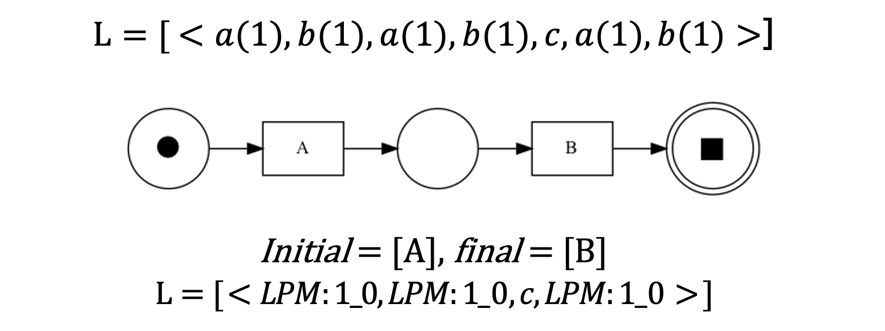
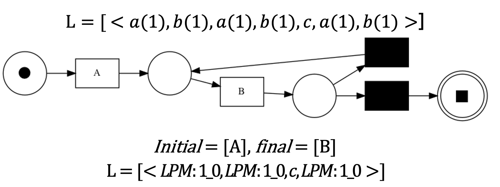
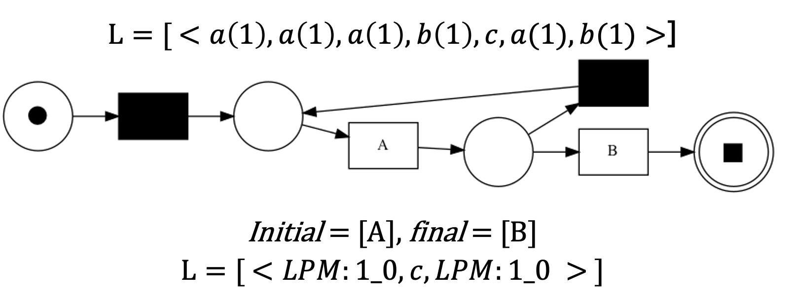

# Subdue compression with Local Process Model
Partendo dall'algoritmo di Process Mining <a href="http://ailab.wsu.edu/subdue/">Subdue</a>, l'obiettivo del seguente progetto didattico è la realizzazione di un algoritmo di compressione che operi con la stessa logica di Subdue, accettando in input file di log anziché grafi. <br>
Subdue è un algoritmo di clustering gerarchico e concettuale, ne deriva che ogni cluster è descritto da un’etichetta e diviso in sotto-cluster, il cui obiettivo è di comprimere il grafo sostituendo tutte le istanze di una sotto-struttura con un puntatore alla struttura stessa. <br>
Per determinare il sotto-grafo candidato, il criterio di scelta di Subdue si basa sulla *Minimum Description Length*. <br>
Dall'analisi preliminare svolta, per soddisfare le specifiche, si renderebbero necessarie le seguenti modifiche a Subdue:
- La struttura in ingresso deve essere un file di log;
- Utilizzare una differente metrica di compressione che tenga conto del concetto di traccia;
- Il processo di sostituzione deve eliminare dal file di log gli eventi della sotto-struttura di interesse, sostituendo la prima occorrenza dell’evento con un’etichetta.

Alla luce delle precedenti problematiche, si è deciso di sviluppare un nuovo algoritmo indipendente da Subdue;

# Team
- <a href= "https://github.com/LucreziAntenucci98">Antenucci Lucrezia</a>;
- <a href= "https://github.com/AlessandroMele">Mele Alessandro</a>;
- <a href= "https://github.com/dadezzzzz">Traini Davide</a>;

# Prerequisiti
- Visual Studio Code;
- Python 3.7.4;
- <a href= "https://pm4py.fit.fraunhofer.de">PM4Py</a>;
- <a href= "https://pandas.pydata.org/">Pandas</a>;

# Installazione delle dipendenze
PM4Py è il principale riferimento per il Process mining in Python;<br>
Pandas è uno strumento di analisi e manipolazione dei dati veloce, potente, flessibile e facile da usare;<br>
Per installare le dipendenze è necessario eseguire da linea di comando:
```bash
pip install pm4py
pip install pandas
```
# Generazione dei LPM
<a href="http://www.promtools.org/doku.php">ProM</a> è un framework open-source sviluppato in Java, estensibile e capace di supportare una grande varietà di tecniche di Process Mining sotto forma di plug-in. <br>
Nella seguente trattazione, è stato utilizzato per generare i *Local Process Model*, da ora in poi denominati LPM, i quali sono analoghi ai grafi candidati generati da Subdue.<br>
Un LPM è una rete di Petri di piccole dimensioni, generalmente composta da cinque o sei nodi, che identifica un comportamento molto frequente in un event log; Tramite ProM, sono stati generati i LPM che fungeranno da input per l’algoritmo di etichettatura degli eventi nel file di log.<br>

# Algoritmo di etichettatura
<a href="">L’algoritmo di etichettatura</a> richiede in input un file di log in formato *.xes* e gli LPM precedentemente ottenuti. In output, restituisce il file *.xes* originale in cui ad ogni evento è assegnata una lista che contiene, se presenti, gli indici dei LPM in cui l’evento occorre. <br>
L’evento, per poter essere etichettato, deve comparire in una traccia valida, altrimenti non viene contrassegnato; una traccia si dice valida se percorre interamente il LPM dallo stato iniziale a quello finale, senza che rimangano token inutilizzati e senza aggiungerne dei nuovi.<br>
Di seguito si riporta un esempio:<br>
</img>

# Scelta del LPM più frequente
Per poter sostituire gli eventi nel file di log, è necessario definire una metrica per identificare il LPM che massimizza la compressione. Per la seguente trattazione, comprimere un file di log equivale ad eliminare il maggior numero di eventi possibili. <br>
Le possibili metriche esaminate sono:
- numero di eventi contrassegnati con il LPM: calcolata come il numero di eventi in cui occorre l’indice relativo al LPM;
- numero di tracce che percorrono il LPM moltiplicato per il numero di transizioni del LPM; è il metodo che maggiormente si avvicina alla metrica utilizzata da Subdue e si calcola come *numeroTracce\*DimensioneLPM*.
L’algoritmo definito nella sezione precedente restituisce il file *.XES* originale in cui ad ogni evento è assegnata una lista che contiene, se presenti, gli indici dei LPM in cui l’evento compare in una traccia valida; perciò, il calcolo della seconda metrica è più semplice, poiché consiste nel scorrere l’event log e calcolare il numero di occorrenze di ogni LPM. <br>
Inoltre, tale metrica definisce esattamente il numero di eventi che saranno sostituiti, perciò si adatta meglio all’obiettivo del progetto.

# Eliminazione del LPM più frequente
Dopo aver individuato il LPM candidato, si comprime il file di log modificando o eliminando gli eventi. Per far ciò, verrà utilizzata una variabile booleana per determinare se l’evento corrente è il primo di una traccia valida per il LPM candidato, ed in questo caso viene sostituito da un evento con nome *LPM:numLPM_Iteration:numIterazione*, altrimenti viene eliminato. <br>
Inoltre, sarà necessario eliminare in ogni evento l’attributo *LPMs*, perché ogni evento verrà etichettato nuovamente nella successiva iterazione.

# Eseguire il programma
Il programma può essere eseguito sia da editor che da linea di comando. <br>
Per eseguire il programma da linea di comando, è necessario posizionarsi nella cartella di progetto:

```bash
cd *path*/subdue_compression_with_lpm
```
ed eseguire
```bash
python3 subdue_extended.py *params*
```
I parametri sono:
```bash
--LPMs_dir, default="./testing/LPMPaymentRequest/", help="path to lpms"

--raw_log_file, default="./testing/RequestForPayment.xes", help="path to raw xes format log file"

--processed_log_file, default="./testing/PaymentRequest_completeLPMs_Aggregated.csv", help="path to location store and name of the output file in csv format"
    
--Min_prefix_size, default=2

--Max_prefix_size, default=36
    
--xes_converted, default="./testing/PaymentRequest_completeLPMs_Aggregated.xes", help="path to location store and name the converted file from csv to xes format"

--out_xes_file, default="./testing/PaymentRequest_completeLPMs_compressed.xes", help="path to location store and name of the compressed output file in xes format"

--limit, default=1, help = "number of iteration of the compression module"

--prefix, default="testLaura_", help = "template filename of lpm"

--suffix, default="pnml", help = "extension of lpm"
```

# Testing
Eliminazione del LPM 2:<br>
</img>
<br>Eliminazione del LPM 1:<br>
</img>
<br>Eliminazione del LPM 1:<br>
</img>
<br>Eliminazione del LPM 1:<br>
</img>
<br>Eliminazione del LPM 1:<br>
</img>
<br>Eliminazione del LPM 1:<br>
</img>
<br>Eliminazione del LPM 1:<br>
</img>